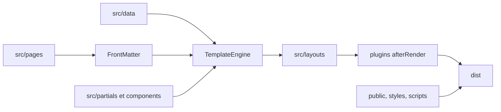

# Architecture

pix-ssg est un générateur PHP sans framework de production. Il transforme les sources de `src/` et `public/` en site statique dans `dist/`.

## Pipeline d’un build

1. Charge les plugins de `plugins/*.php`.
2. vide entièrement `dist/`.
3. charge les données JSON et PHP de `src/data/`.
4. parcourt récursivement les pages HTML de `src/pages/`.
5. analyse le front matter de chaque page.
6. rend les variables, partials et composants du contenu.
7. applique le layout déclaré.
8. exécute les filtres `afterRender`.
9. écrit la page dans `dist/`.
10. copie `public/`, `src/styles/` et `src/scripts/`.

## Principes

- `dist/` est jetable et entièrement reproductible.
- les sources ne sont jamais modifiées par le build.
- le moteur est isolé dans `engine/`.
- les extensions passent par `plugins/`.
- le CSS reste natif.
- le catalogue installe uniquement sous `src/` et protège les fichiers modifiés par empreinte SHA-256.

## Contexte de rendu

Les données globales sont chargées depuis `src/data/`. Le front matter de la page est ajouté sous la clé `page`. Le layout reçoit aussi `content`, qui contient le HTML déjà rendu de la page.

## Sorties

Une page conserve son chemin relatif par défaut : `src/pages/about.html` devient `dist/about.html`. Le champ front matter `permalink` peut remplacer ce chemin.

Voir aussi [API interne](reference/api.md) et [limites connues](reference/limitations.md).
