# Catalogue des templates

Ce catalogue présente les aperçus, les instructions d’intégration et les commandes des templates disponibles.

## Cartes

### Cartes article

`card/article-card`

Version installable du template Cartes article, configurable par données JSON.

**Desktop**


**Tablette**


**Mobile**


**Installer**

```bash
./pix-ssg templates installer card/article-card
```

**Intégrer**

- Fichier cible : `src/pages/<nom-de-page>.html`
- Emplacement : Dans <main>, à l’endroit où le composant doit apparaître : {{ component:article-card }}
- Données : `src/data/article_card.json`

```html
{{ component:article-card }}
<link rel="stylesheet" href="/assets/css/templates/article-card.css" />
```

**Désinstaller**

```bash
./pix-ssg templates desinstaller card/article-card
```

Documentation détaillée : [`card/article-card/README.md`](card/article-card/README.md)

---

### Cartes profil

`card/profile-card`

Version installable du template Cartes profil, configurable par données JSON.

**Desktop**


**Tablette**


**Mobile**


**Installer**

```bash
./pix-ssg templates installer card/profile-card
```

**Intégrer**

- Fichier cible : `src/pages/<nom-de-page>.html`
- Emplacement : Dans <main>, à l’endroit où le composant doit apparaître : {{ component:profile-card }}
- Données : `src/data/profile_card.json`

```html
{{ component:profile-card }}
<link rel="stylesheet" href="/assets/css/templates/profile-card.css" />
```

**Désinstaller**

```bash
./pix-ssg templates desinstaller card/profile-card
```

Documentation détaillée : [`card/profile-card/README.md`](card/profile-card/README.md)

---

### Cartes statistiques

`card/stats-card`

Version installable du template Cartes statistiques, configurable par données JSON.

**Desktop**

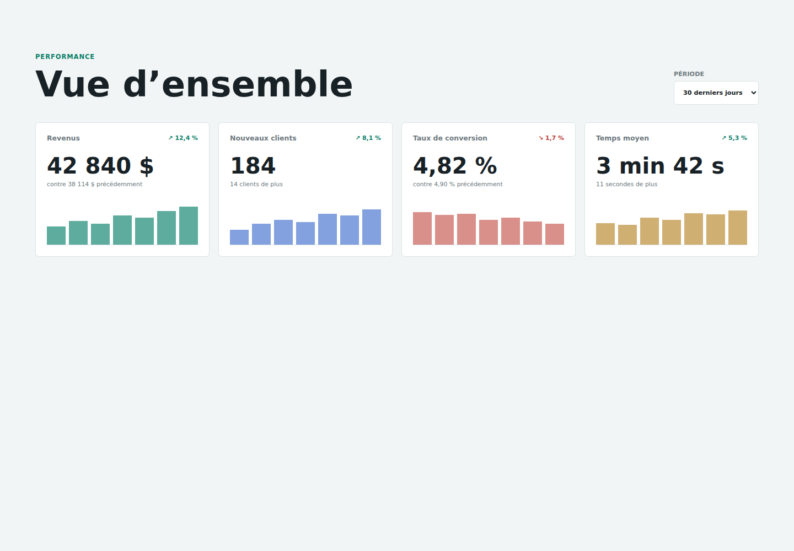

**Tablette**

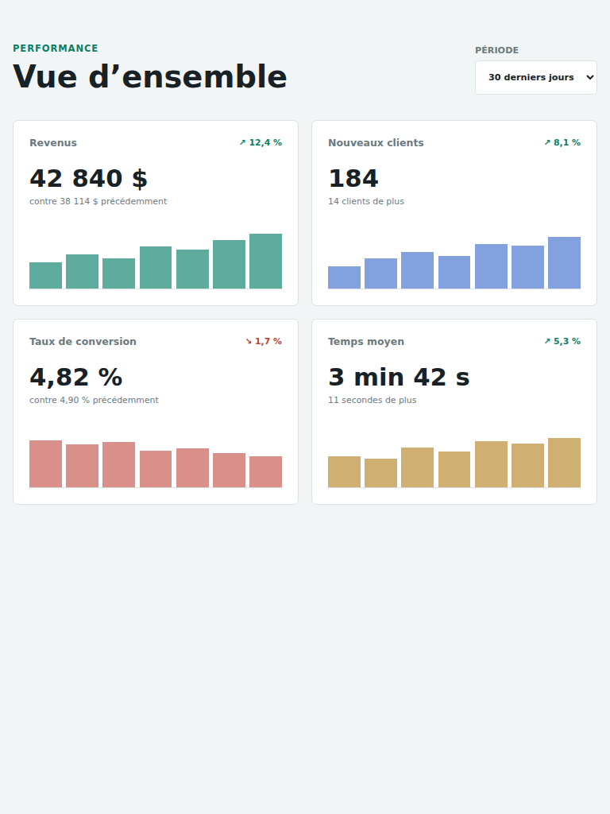

**Mobile**

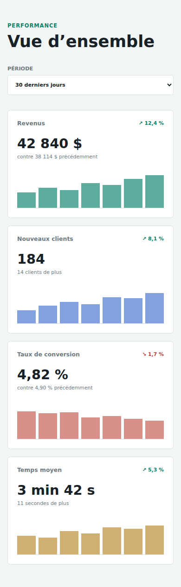

**Installer**

```bash
./pix-ssg templates installer card/stats-card
```

**Intégrer**

- Fichier cible : `src/pages/<nom-de-page>.html`
- Emplacement : Dans <main>, à l’endroit où le composant doit apparaître : {{ component:stats-card }}
- Données : `src/data/stats_card.json`

```html
{{ component:stats-card }}
<link rel="stylesheet" href="/assets/css/templates/stats-card.css" />
```

**Désinstaller**

```bash
./pix-ssg templates desinstaller card/stats-card
```

Documentation détaillée : [`card/stats-card/README.md`](card/stats-card/README.md)

---

### Product Card

`card/product-card`

Carte produit responsive configurable par données JSON.

**Desktop**

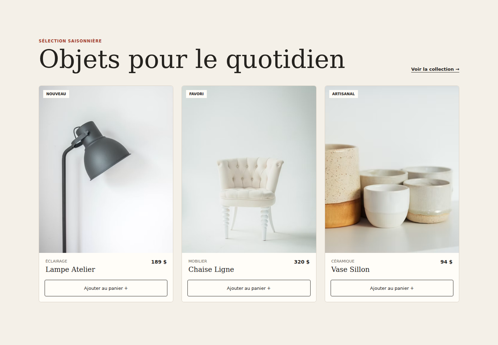

**Tablette**

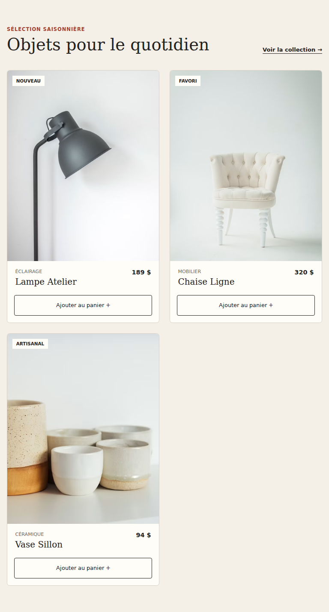

**Mobile**

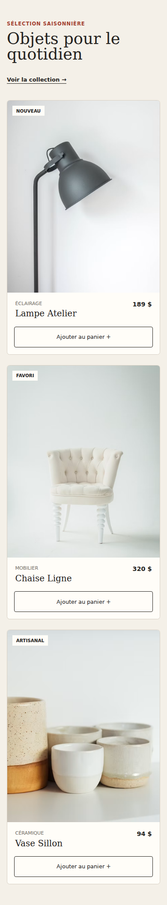

**Installer**

```bash
./pix-ssg templates installer card/product-card
```

**Intégrer**

- Fichier cible : `src/pages/<nom-de-page>.html`
- Emplacement : Dans <main>, à l’endroit où la carte doit apparaître.
- Données : `src/data/product_card.json`

```html
{{ component:product-card }}
<link rel="stylesheet" href="/assets/css/templates/product-card.css" />
```

**Désinstaller**

```bash
./pix-ssg templates desinstaller card/product-card
```

Documentation détaillée : [`card/product-card/README.md`](card/product-card/README.md)

---

## Pieds de page

### Footer Minimal

`footer/footer-minimal`

Pied de page compact avec marque, mentions légales et liens essentiels.

**Desktop**

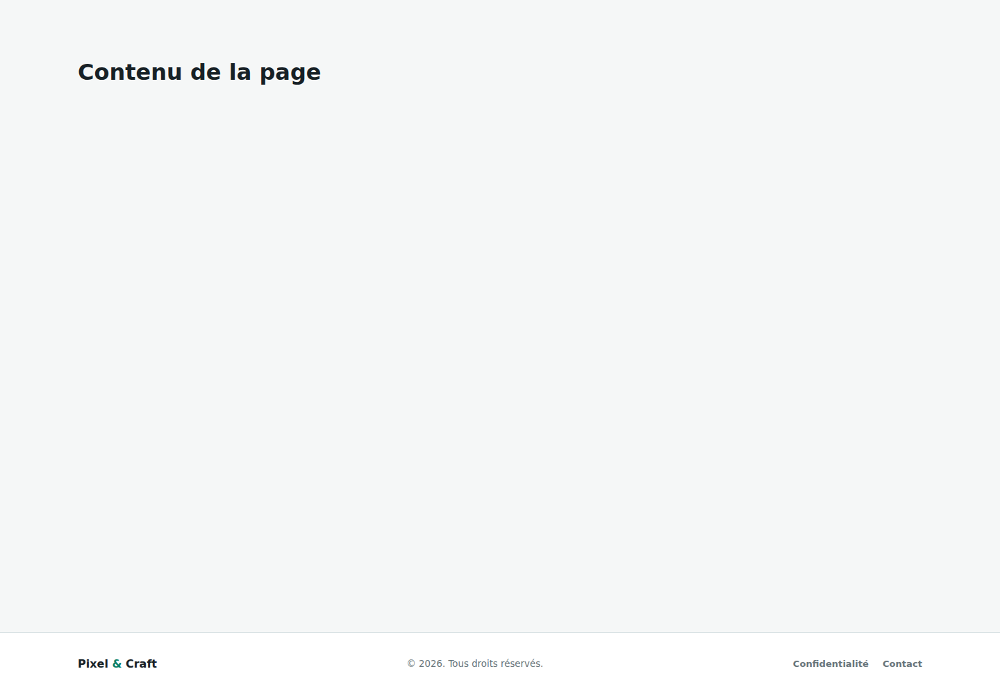

**Tablette**

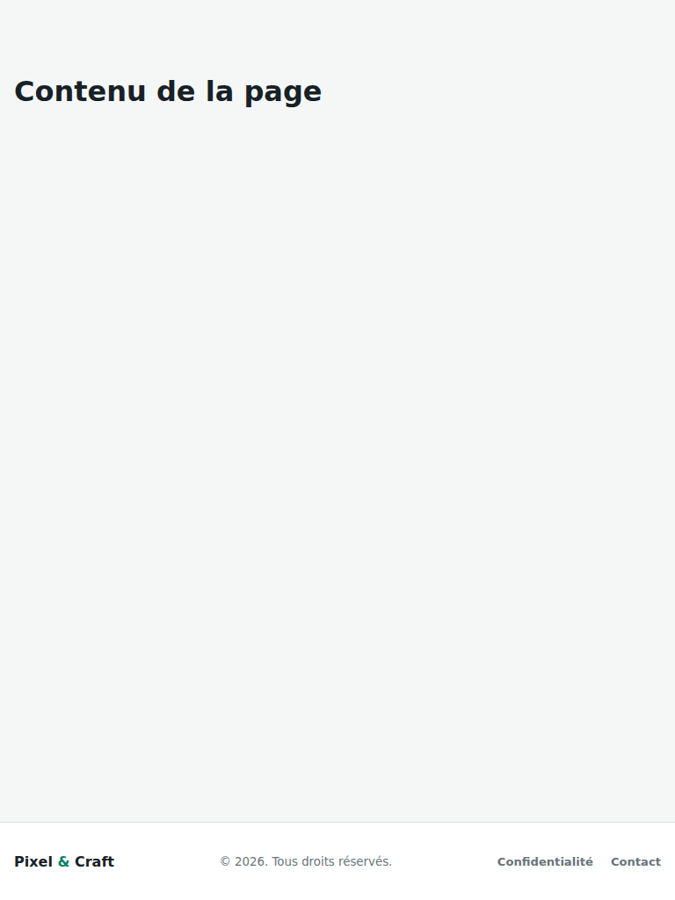

**Mobile**

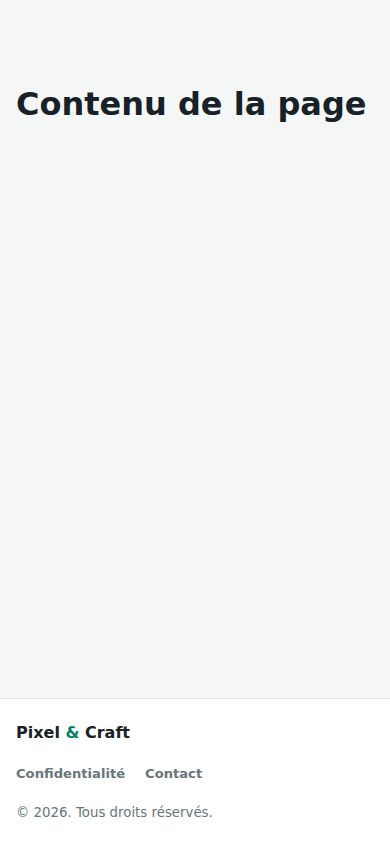

**Installer**

```bash
./pix-ssg templates installer footer/footer-minimal
```

**Intégrer**

- Fichier cible : `src/layouts/default.html`
- Emplacement : Dans <body>, juste après {{{ content }}} et avant </body>.
- Données : `src/data/footer_minimal.json`

```html
{{ partial:footer-minimal }}
<link rel="stylesheet" href="/assets/css/templates/footer-minimal.css" />
```

**Désinstaller**

```bash
./pix-ssg templates desinstaller footer/footer-minimal
```

Documentation détaillée : [`footer/footer-minimal/README.md`](footer/footer-minimal/README.md)

---

### Footer complet

`footer/footer-rich`

Version installable du template Footer complet, configurable par données JSON.

**Desktop**

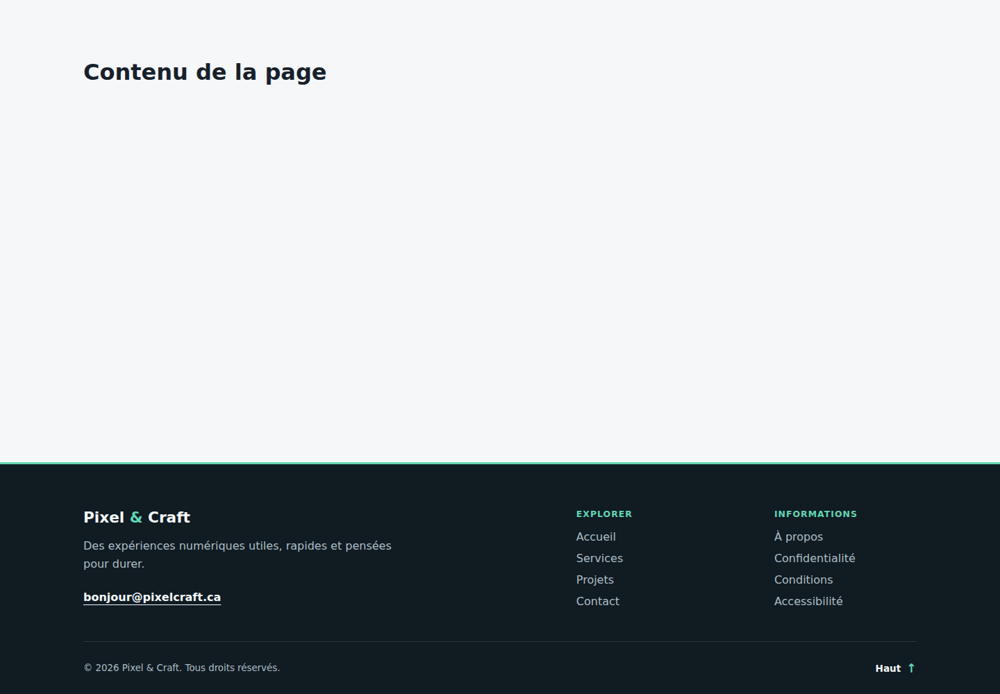

**Tablette**

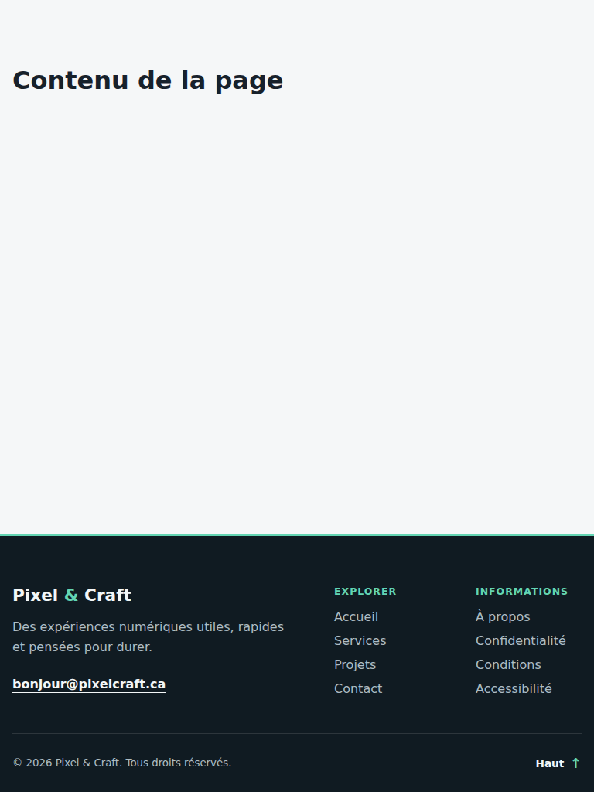

**Mobile**

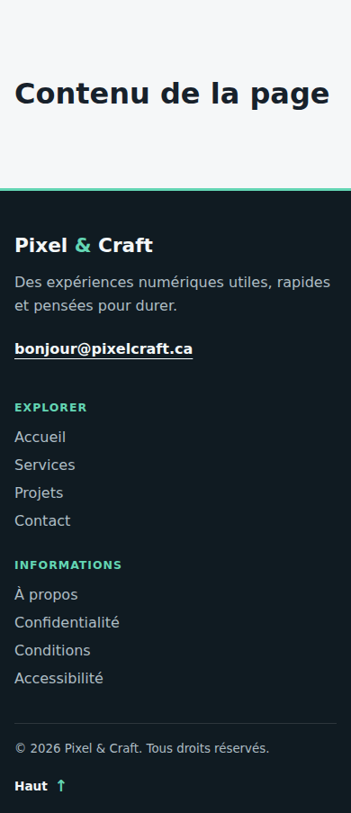

**Installer**

```bash
./pix-ssg templates installer footer/footer-rich
```

**Intégrer**

- Fichier cible : `src/layouts/default.html`
- Emplacement : Dans <body>, juste après {{{ content }}} et avant </body> : {{ partial:footer-rich }}
- Données : `src/data/footer_rich.json`

```html
{{ partial:footer-rich }}
<link rel="stylesheet" href="/assets/css/templates/footer-rich.css" />
```

**Désinstaller**

```bash
./pix-ssg templates desinstaller footer/footer-rich
```

Documentation détaillée : [`footer/footer-rich/README.md`](footer/footer-rich/README.md)

---

### Footer en colonnes

`footer/footer-columns`

Version installable du template Footer en colonnes, configurable par données JSON.

**Desktop**

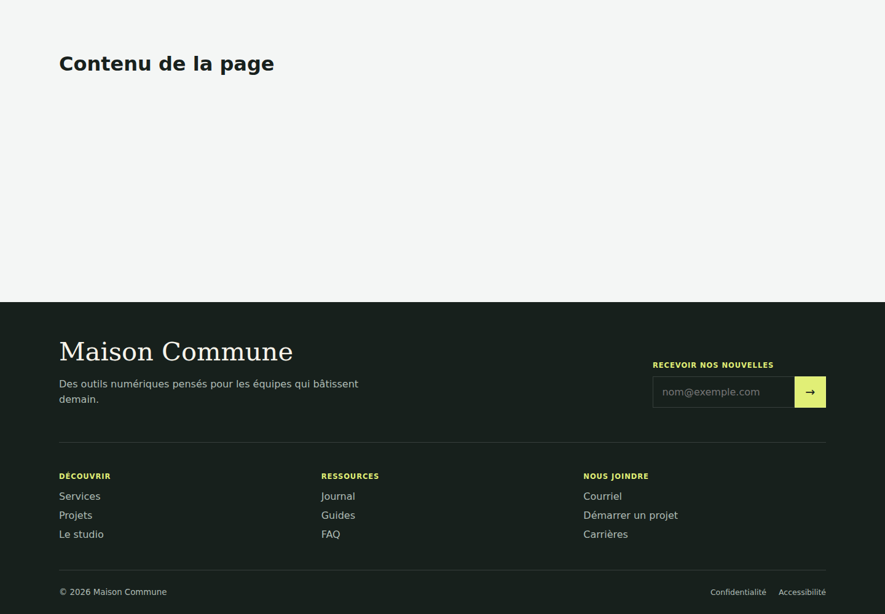

**Tablette**

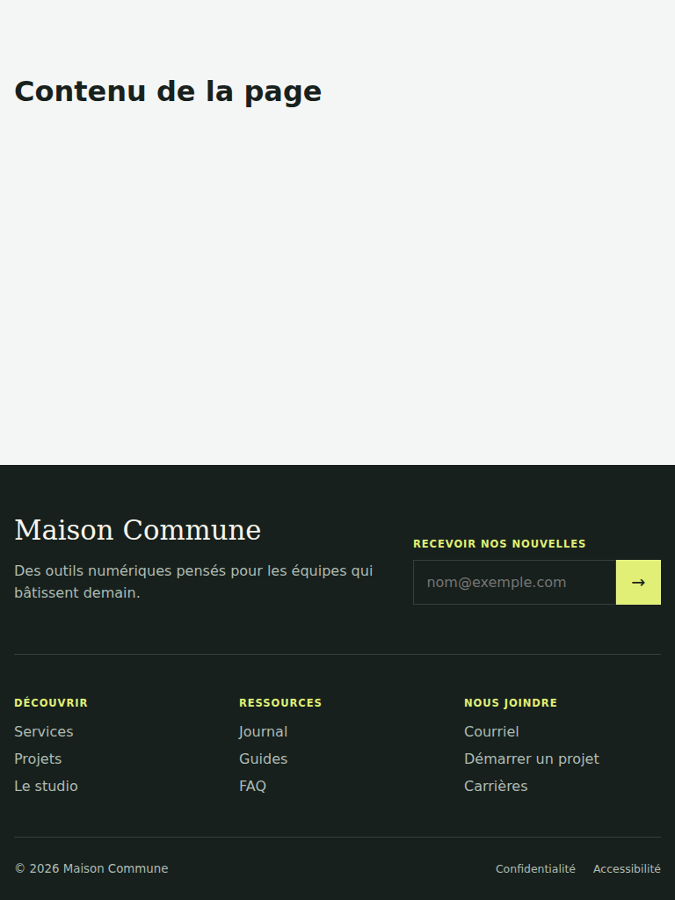

**Mobile**

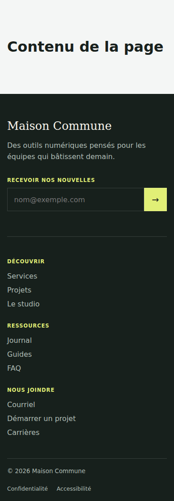

**Installer**

```bash
./pix-ssg templates installer footer/footer-columns
```

**Intégrer**

- Fichier cible : `src/layouts/default.html`
- Emplacement : Dans <body>, juste après {{{ content }}} et avant </body> : {{ partial:footer-columns }}
- Données : `src/data/footer_columns.json`

```html
{{ partial:footer-columns }}
<link rel="stylesheet" href="/assets/css/templates/footer-columns.css" />
```

**Désinstaller**

```bash
./pix-ssg templates desinstaller footer/footer-columns
```

Documentation détaillée : [`footer/footer-columns/README.md`](footer/footer-columns/README.md)

---

## Formulaires

### Contact Form

`form/contact-form`

Formulaire de contact accessible avec textes et destination configurables.

**Desktop**

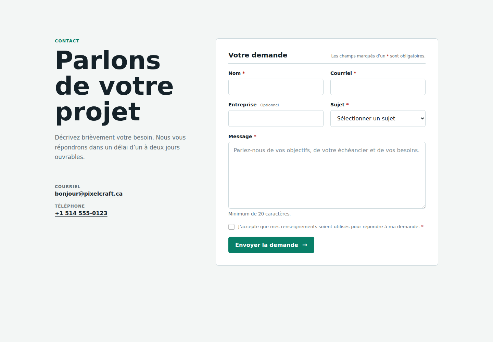

**Tablette**

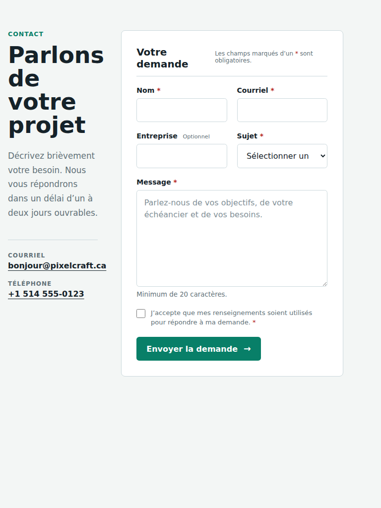

**Mobile**

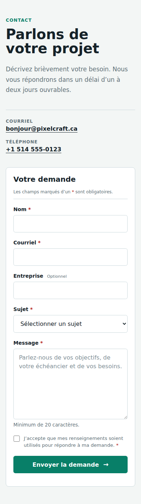

**Installer**

```bash
./pix-ssg templates installer form/contact-form
```

**Intégrer**

- Fichier cible : `src/pages/contact.html`
- Emplacement : Dans <main id="main-content">, à l’endroit du formulaire.
- Données : `src/data/contact_form.json`

```html
{{ component:contact-form }}
<link rel="stylesheet" href="/assets/css/templates/contact-form.css" />
```

**Désinstaller**

```bash
./pix-ssg templates desinstaller form/contact-form
```

Documentation détaillée : [`form/contact-form/README.md`](form/contact-form/README.md)

---

### Formulaire de connexion

`form/login-form`

Version installable du template Formulaire de connexion, configurable par données JSON.

**Desktop**

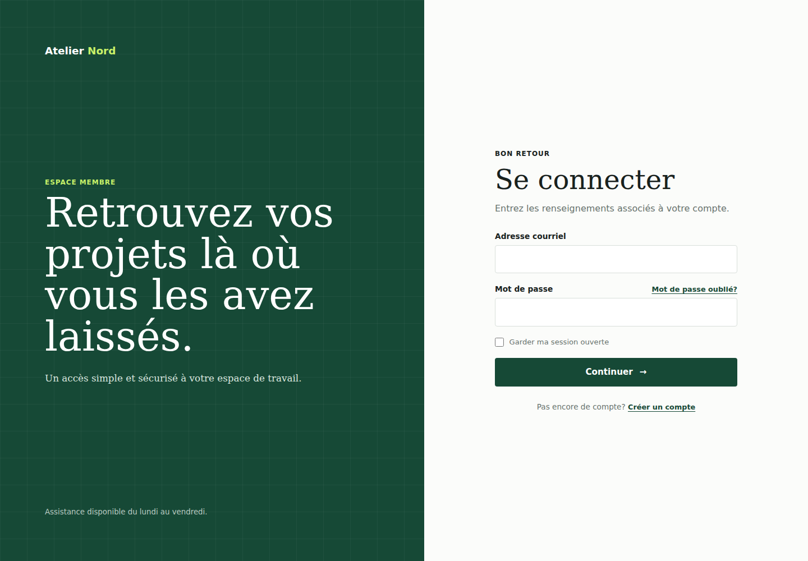

**Tablette**

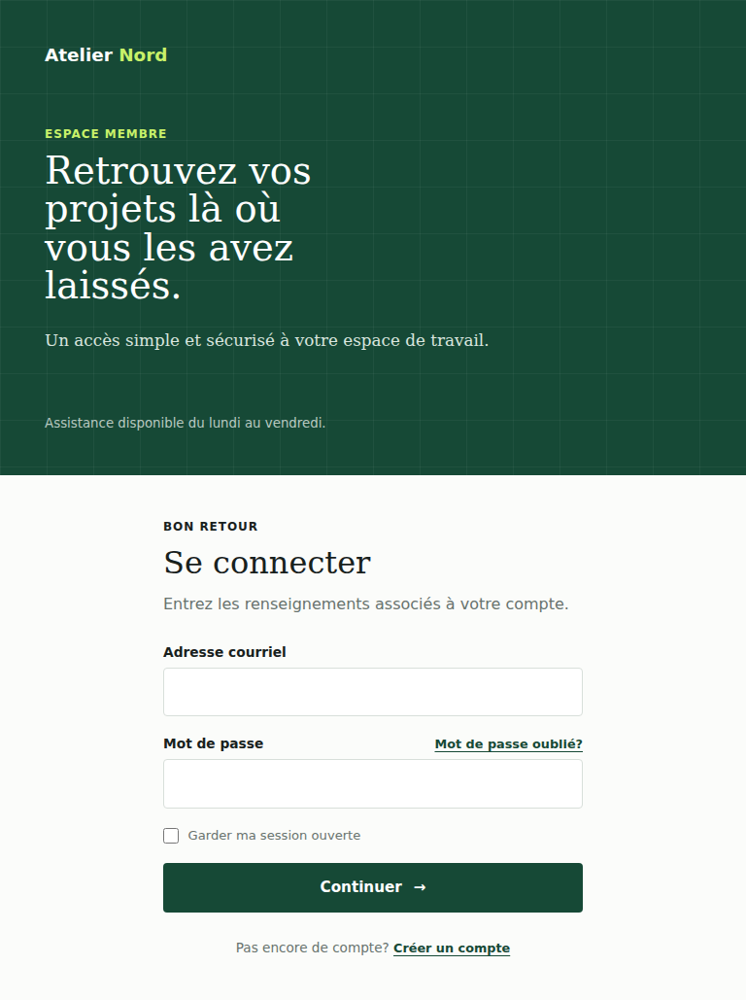

**Mobile**

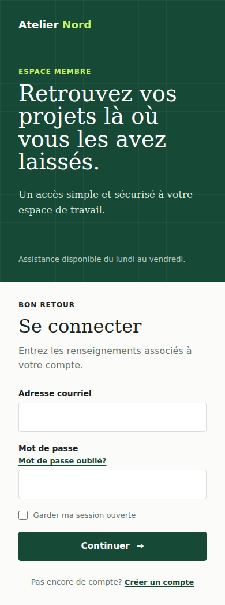

**Installer**

```bash
./pix-ssg templates installer form/login-form
```

**Intégrer**

- Fichier cible : `src/pages/<nom-de-page>.html`
- Emplacement : Dans <main>, à l’endroit où le composant doit apparaître : {{ component:login-form }}
- Données : `src/data/login_form.json`

```html
{{ component:login-form }}
<link rel="stylesheet" href="/assets/css/templates/login-form.css" />
```

**Désinstaller**

```bash
./pix-ssg templates desinstaller form/login-form
```

Documentation détaillée : [`form/login-form/README.md`](form/login-form/README.md)

---

### Formulaire de devis

`form/quote-form`

Version installable du template Formulaire de devis, configurable par données JSON.

**Desktop**

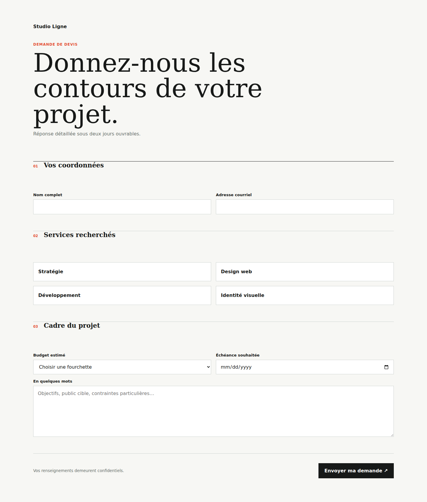

**Tablette**

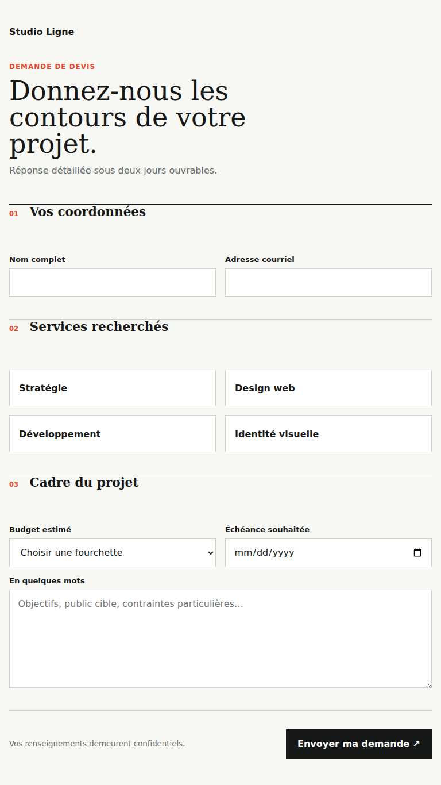

**Mobile**

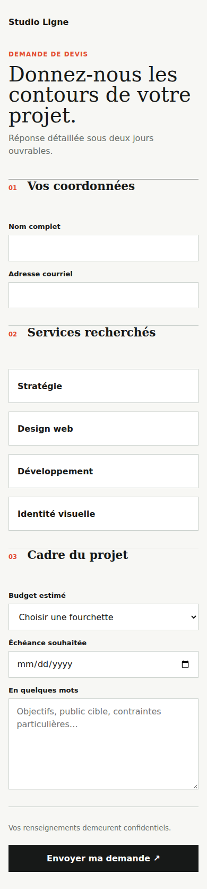

**Installer**

```bash
./pix-ssg templates installer form/quote-form
```

**Intégrer**

- Fichier cible : `src/pages/<nom-de-page>.html`
- Emplacement : Dans <main>, à l’endroit où le composant doit apparaître : {{ component:quote-form }}
- Données : `src/data/quote_form.json`

```html
{{ component:quote-form }}
<link rel="stylesheet" href="/assets/css/templates/quote-form.css" />
```

**Désinstaller**

```bash
./pix-ssg templates desinstaller form/quote-form
```

Documentation détaillée : [`form/quote-form/README.md`](form/quote-form/README.md)

---

### Formulaire d’inscription

`form/signup-form`

Version installable du template Formulaire d’inscription, configurable par données JSON.

**Desktop**

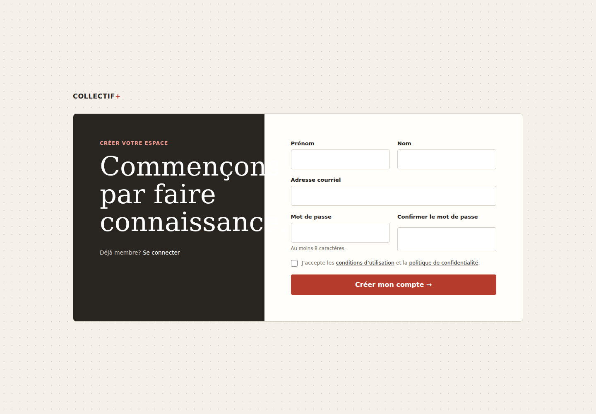

**Tablette**

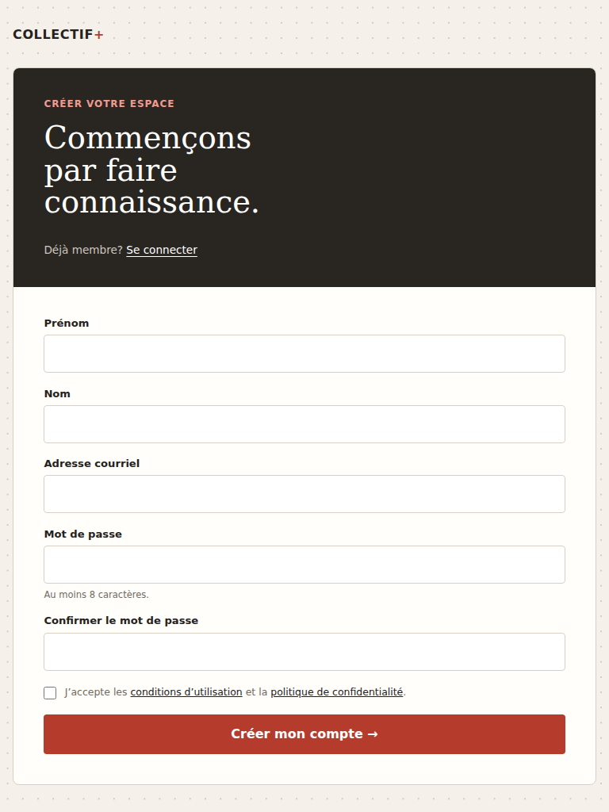

**Mobile**

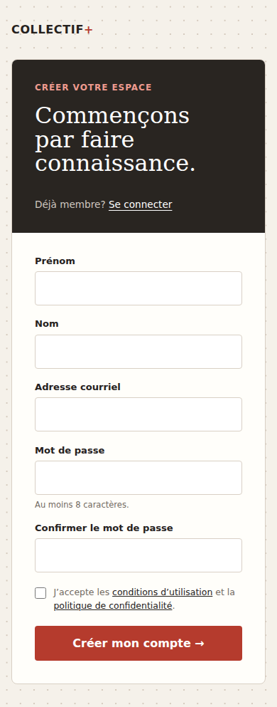

**Installer**

```bash
./pix-ssg templates installer form/signup-form
```

**Intégrer**

- Fichier cible : `src/pages/<nom-de-page>.html`
- Emplacement : Dans <main>, à l’endroit où le composant doit apparaître : {{ component:signup-form }}
- Données : `src/data/signup_form.json`

```html
{{ component:signup-form }}
<link rel="stylesheet" href="/assets/css/templates/signup-form.css" />
```

**Désinstaller**

```bash
./pix-ssg templates desinstaller form/signup-form
```

Documentation détaillée : [`form/signup-form/README.md`](form/signup-form/README.md)

---

### Formulaire infolettre

`form/newsletter-form`

Version installable du template Formulaire infolettre, configurable par données JSON.

**Desktop**


**Tablette**

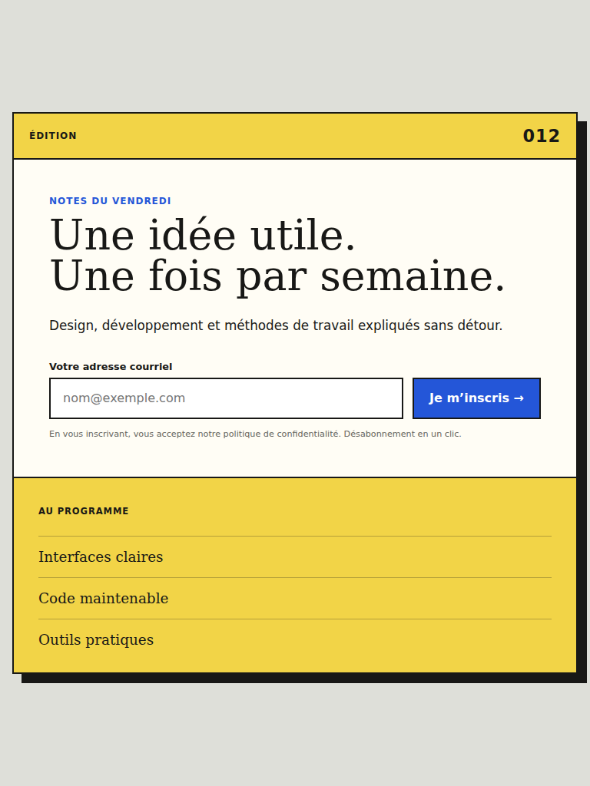

**Mobile**

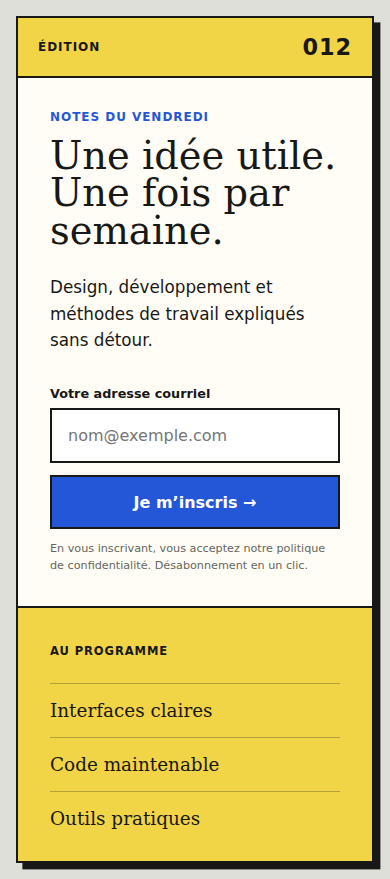

**Installer**

```bash
./pix-ssg templates installer form/newsletter-form
```

**Intégrer**

- Fichier cible : `src/pages/<nom-de-page>.html`
- Emplacement : Dans <main>, à l’endroit où le composant doit apparaître : {{ component:newsletter-form }}
- Données : `src/data/newsletter_form.json`

```html
{{ component:newsletter-form }}
<link rel="stylesheet" href="/assets/css/templates/newsletter-form.css" />
```

**Désinstaller**

```bash
./pix-ssg templates desinstaller form/newsletter-form
```

Documentation détaillée : [`form/newsletter-form/README.md`](form/newsletter-form/README.md)

---

## En-têtes

### Header Basic

`header/header-basic`

Header responsive avec navigation de bureau, menu mobile natif et lien d’évitement.

**Desktop**

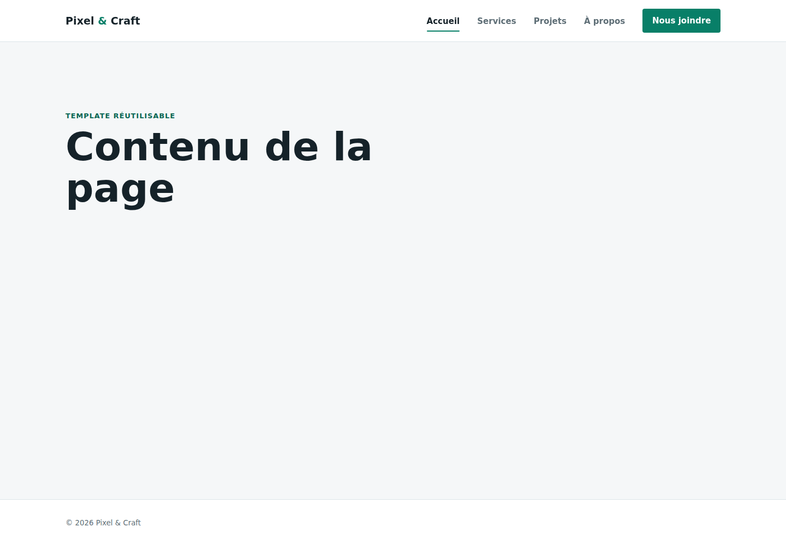

**Tablette**

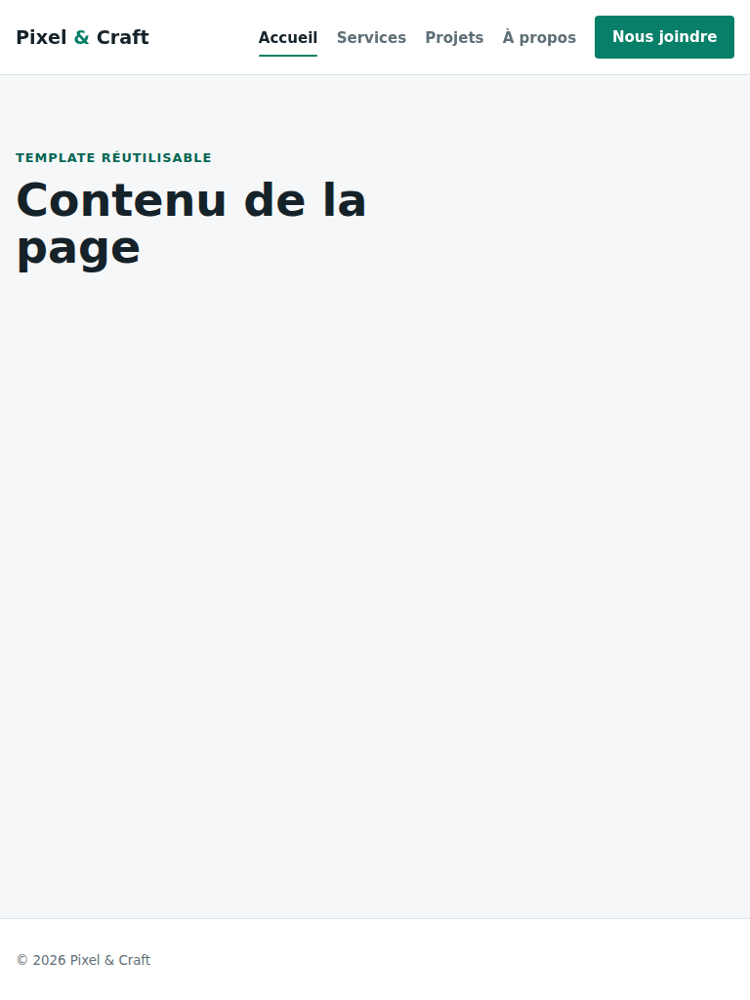

**Mobile**

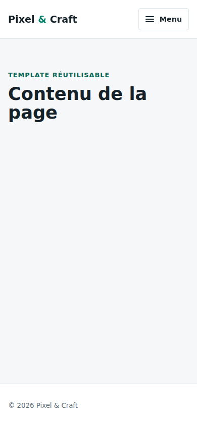

**Installer**

```bash
./pix-ssg templates installer header/header-basic
```

**Intégrer**

- Fichier cible : `src/layouts/default.html`
- Emplacement : Dans <body>, juste avant {{{ content }}}.
- Données : `src/data/header_basic.json`

```html
{{ partial:header-basic }}
<link rel="stylesheet" href="/assets/css/templates/header-basic.css" />
```

**Désinstaller**

```bash
./pix-ssg templates desinstaller header/header-basic
```

Documentation détaillée : [`header/header-basic/README.md`](header/header-basic/README.md)

---

### Header centré

`header/header-centre`

Version installable du template Header centré, configurable par données JSON.

**Desktop**


**Tablette**


**Mobile**

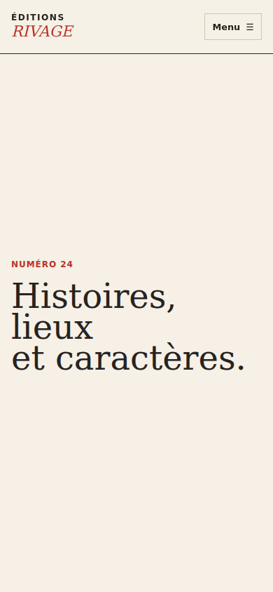

**Installer**

```bash
./pix-ssg templates installer header/header-centre
```

**Intégrer**

- Fichier cible : `src/layouts/default.html`
- Emplacement : Dans <body>, juste avant {{{ content }}} : {{ partial:header-centre }}
- Données : `src/data/header_centre.json`

```html
{{ partial:header-centre }}
<link rel="stylesheet" href="/assets/css/templates/header-centre.css" />
```

**Désinstaller**

```bash
./pix-ssg templates desinstaller header/header-centre
```

Documentation détaillée : [`header/header-centre/README.md`](header/header-centre/README.md)

---

### Header dashboard

`header/header-dashboard`

Version installable du template Header dashboard, configurable par données JSON.

**Desktop**

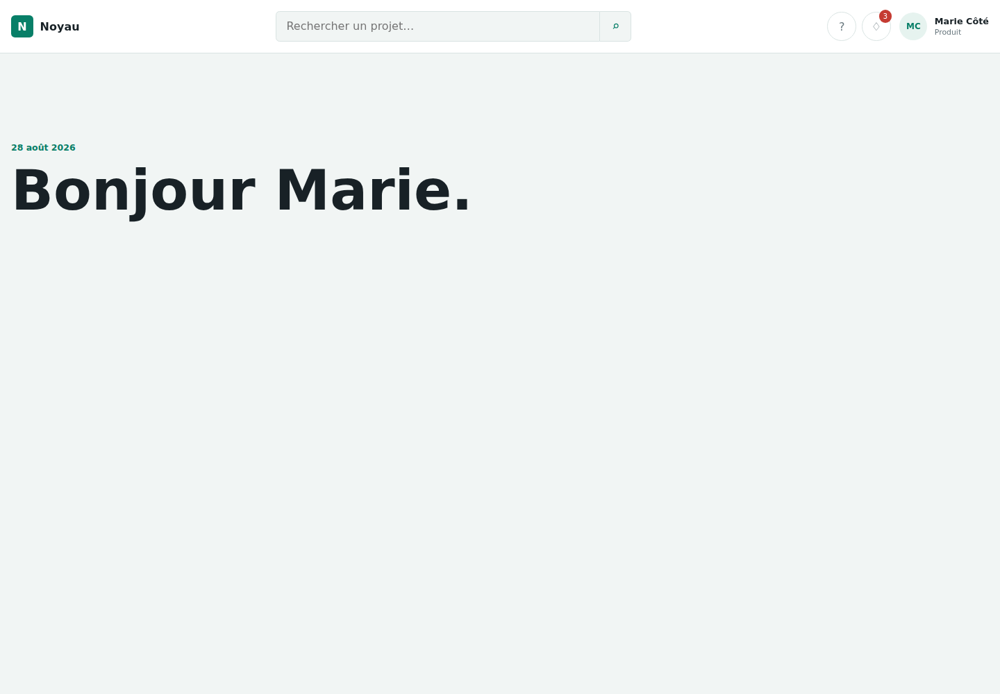

**Tablette**

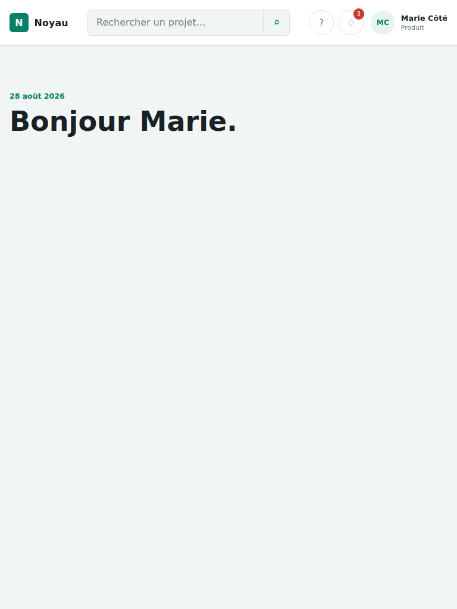

**Mobile**

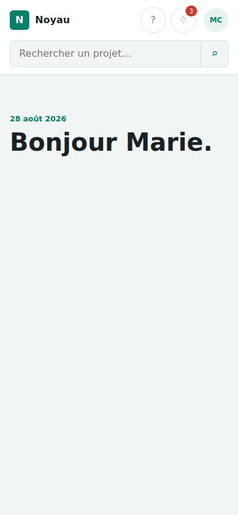

**Installer**

```bash
./pix-ssg templates installer header/header-dashboard
```

**Intégrer**

- Fichier cible : `src/layouts/default.html`
- Emplacement : Dans <body>, juste avant {{{ content }}} : {{ partial:header-dashboard }}
- Données : `src/data/header_dashboard.json`

```html
{{ partial:header-dashboard }}
<link rel="stylesheet" href="/assets/css/templates/header-dashboard.css" />
```

**Désinstaller**

```bash
./pix-ssg templates desinstaller header/header-dashboard
```

Documentation détaillée : [`header/header-dashboard/README.md`](header/header-dashboard/README.md)

---

## Barres latérales

### Sidebar Basic

`sidebar/sidebar-basic`

Navigation latérale compacte configurable par données JSON.

**Desktop**

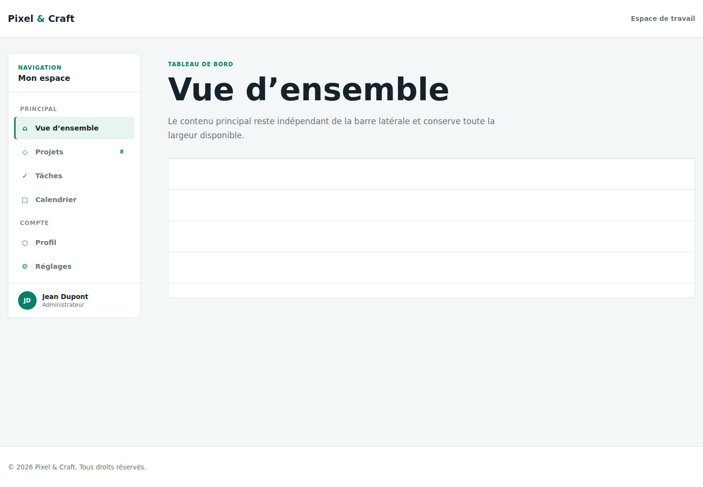

**Tablette**

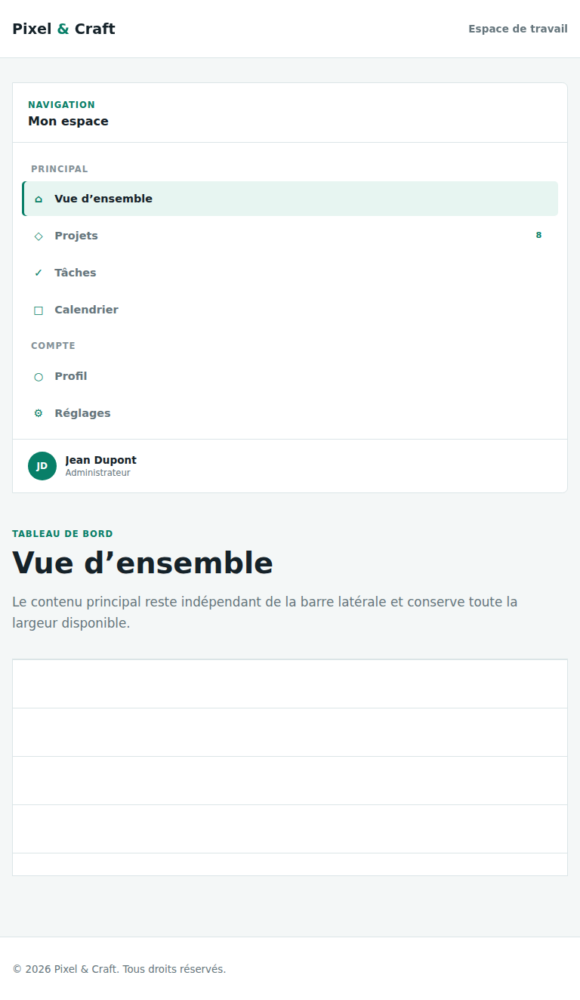

**Mobile**

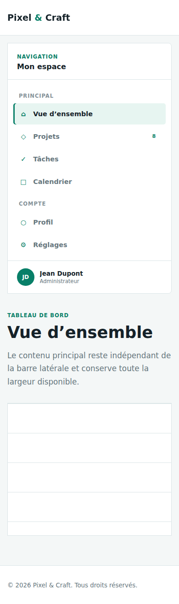

**Installer**

```bash
./pix-ssg templates installer sidebar/sidebar-basic
```

**Intégrer**

- Fichier cible : `src/layouts/default.html`
- Emplacement : Dans .app-shell, avant le conteneur qui contient {{{ content }}}.
- Données : `src/data/sidebar_basic.json`

```html
{{ partial:sidebar-basic }}
<link rel="stylesheet" href="/assets/css/templates/sidebar-basic.css" />
```

**Désinstaller**

```bash
./pix-ssg templates desinstaller sidebar/sidebar-basic
```

Documentation détaillée : [`sidebar/sidebar-basic/README.md`](sidebar/sidebar-basic/README.md)

---

### Sidebar compacte

`sidebar/sidebar-compact`

Version installable du template Sidebar compacte, configurable par données JSON.

**Desktop**

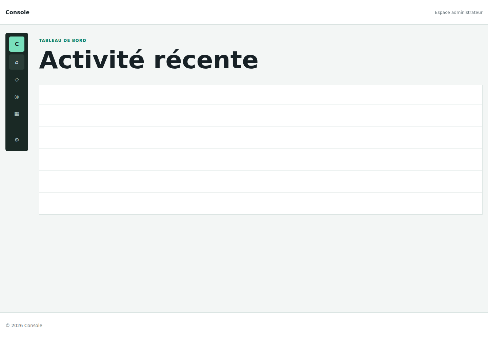

**Tablette**

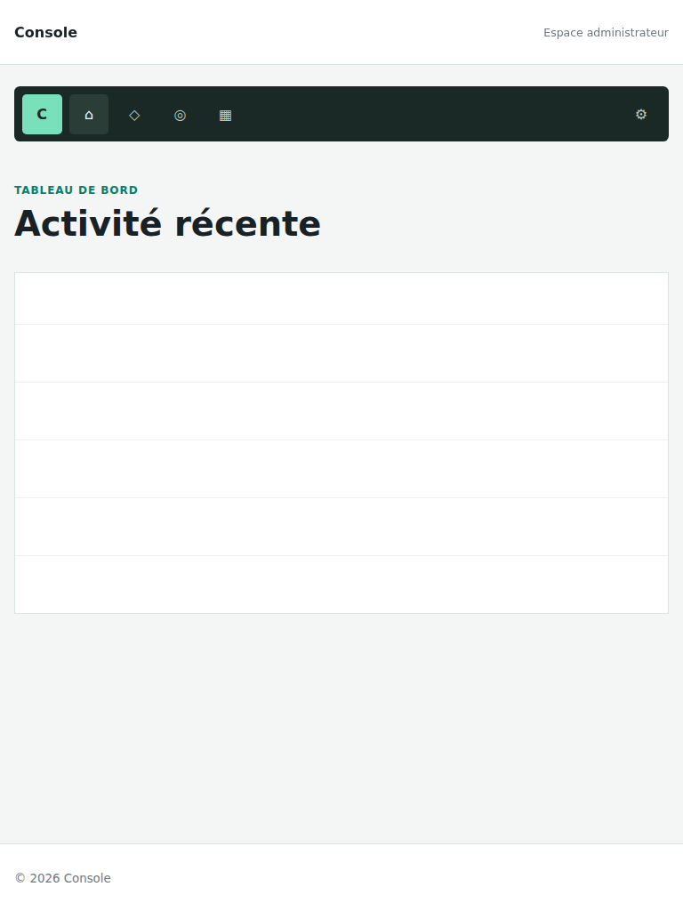

**Mobile**

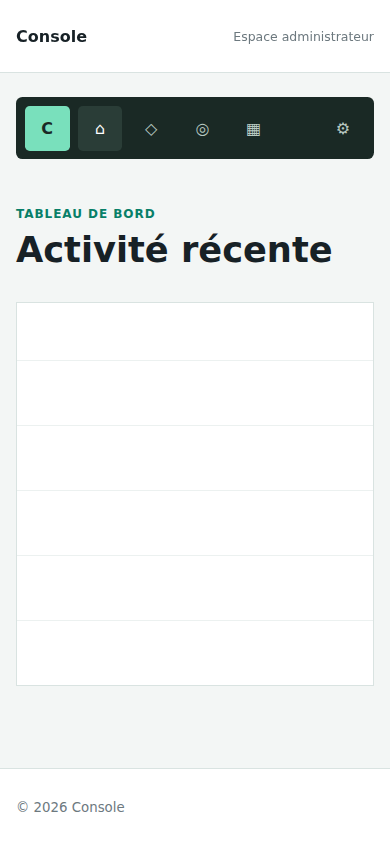

**Installer**

```bash
./pix-ssg templates installer sidebar/sidebar-compact
```

**Intégrer**

- Fichier cible : `src/layouts/default.html`
- Emplacement : Dans le conteneur de mise en page, avant le bloc qui contient {{{ content }}} : {{ partial:sidebar-compact }}
- Données : `src/data/sidebar_compact.json`

```html
{{ partial:sidebar-compact }}
<link rel="stylesheet" href="/assets/css/templates/sidebar-compact.css" />
```

**Désinstaller**

```bash
./pix-ssg templates desinstaller sidebar/sidebar-compact
```

Documentation détaillée : [`sidebar/sidebar-compact/README.md`](sidebar/sidebar-compact/README.md)

---

### Sidebar à sections

`sidebar/sidebar-sections`

Version installable du template Sidebar à sections, configurable par données JSON.

**Desktop**

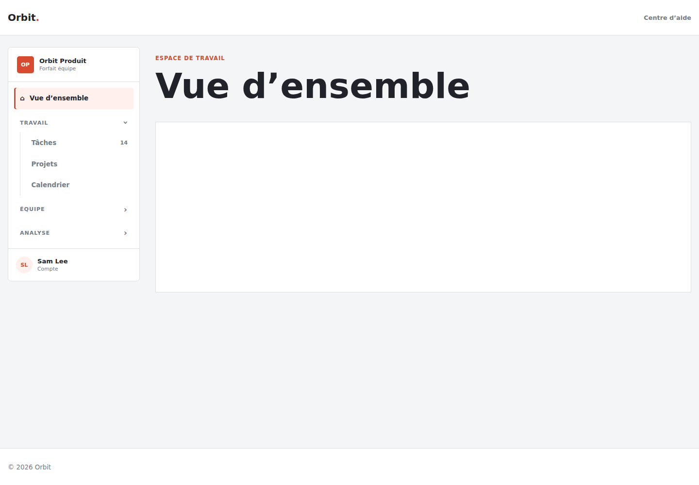

**Tablette**

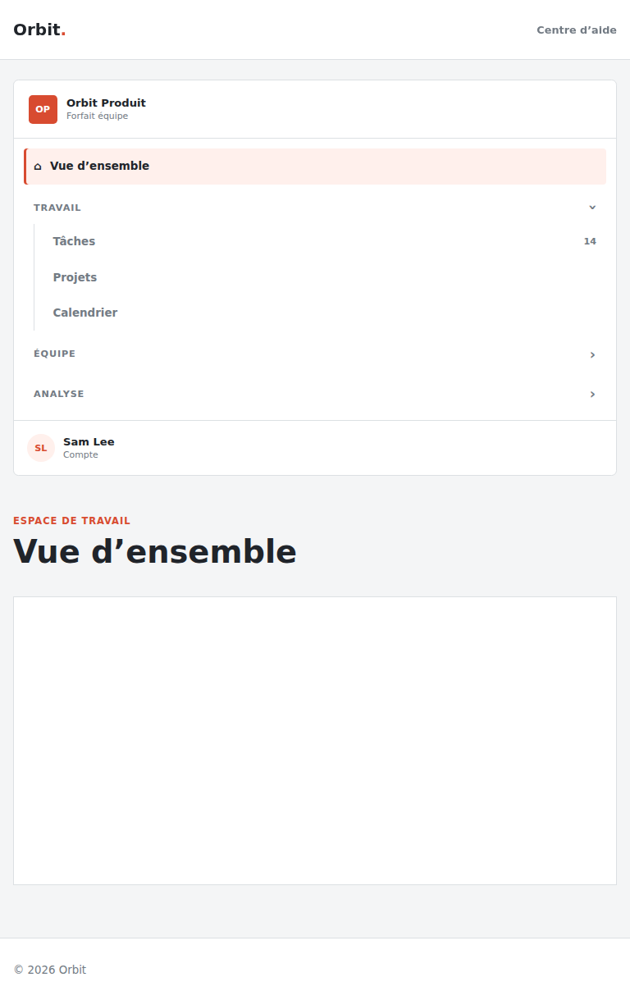

**Mobile**

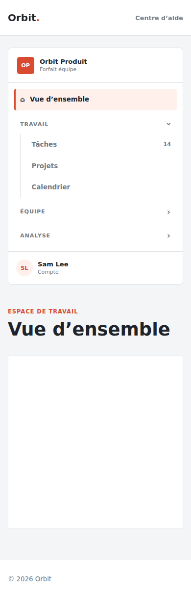

**Installer**

```bash
./pix-ssg templates installer sidebar/sidebar-sections
```

**Intégrer**

- Fichier cible : `src/layouts/default.html`
- Emplacement : Dans le conteneur de mise en page, avant le bloc qui contient {{{ content }}} : {{ partial:sidebar-sections }}
- Données : `src/data/sidebar_sections.json`

```html
{{ partial:sidebar-sections }}
<link rel="stylesheet" href="/assets/css/templates/sidebar-sections.css" />
```

**Désinstaller**

```bash
./pix-ssg templates desinstaller sidebar/sidebar-sections
```

Documentation détaillée : [`sidebar/sidebar-sections/README.md`](sidebar/sidebar-sections/README.md)

---

## Tableaux

### Status Table

`table/status-table`

Tableau compact et responsive pour présenter le statut d’un élément.

**Desktop**

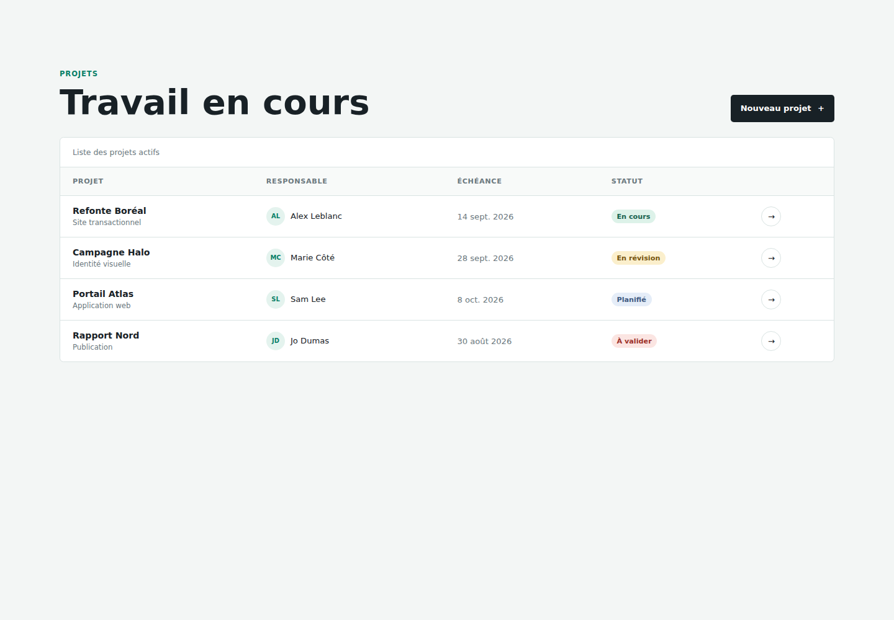

**Tablette**

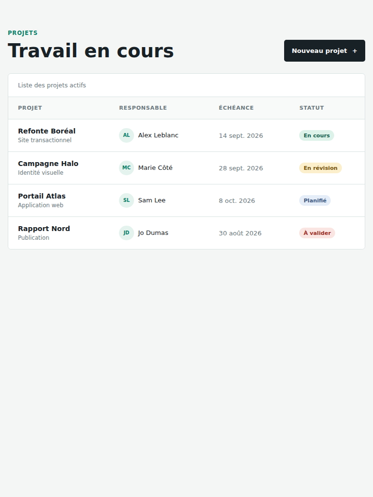

**Mobile**

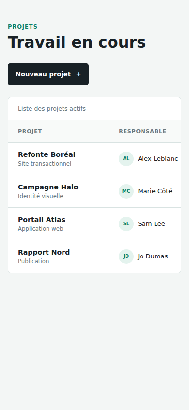

**Installer**

```bash
./pix-ssg templates installer table/status-table
```

**Intégrer**

- Fichier cible : `src/pages/<nom-de-page>.html`
- Emplacement : Dans <main>, à l’endroit où le tableau doit apparaître.
- Données : `src/data/status_table.json`

```html
{{ component:status-table }}
<link rel="stylesheet" href="/assets/css/templates/status-table.css" />
```

**Désinstaller**

```bash
./pix-ssg templates desinstaller table/status-table
```

Documentation détaillée : [`table/status-table/README.md`](table/status-table/README.md)

---

### Tableau comparatif

`table/comparison-table`

Version installable du template Tableau comparatif, configurable par données JSON.

**Desktop**

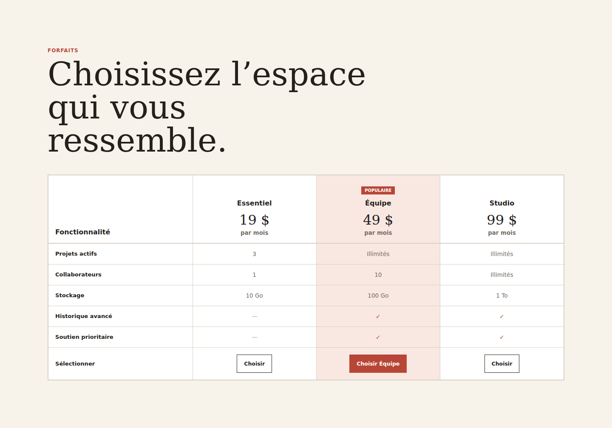

**Tablette**

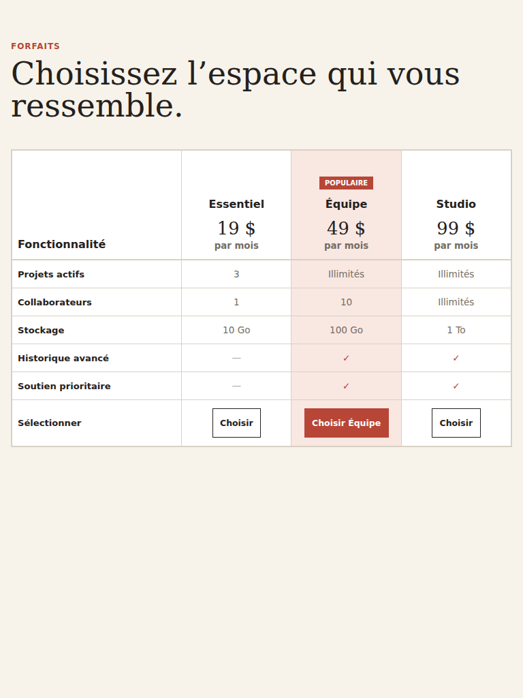

**Mobile**

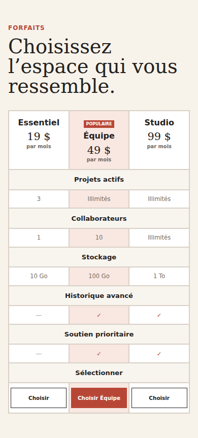

**Installer**

```bash
./pix-ssg templates installer table/comparison-table
```

**Intégrer**

- Fichier cible : `src/pages/<nom-de-page>.html`
- Emplacement : Dans <main>, à l’endroit où le composant doit apparaître : {{ component:comparison-table }}
- Données : `src/data/comparison_table.json`

```html
{{ component:comparison-table }}
<link rel="stylesheet" href="/assets/css/templates/comparison-table.css" />
```

**Désinstaller**

```bash
./pix-ssg templates desinstaller table/comparison-table
```

Documentation détaillée : [`table/comparison-table/README.md`](table/comparison-table/README.md)

---

### Tableau de données

`table/data-table`

Version installable du template Tableau de données, configurable par données JSON.

**Desktop**

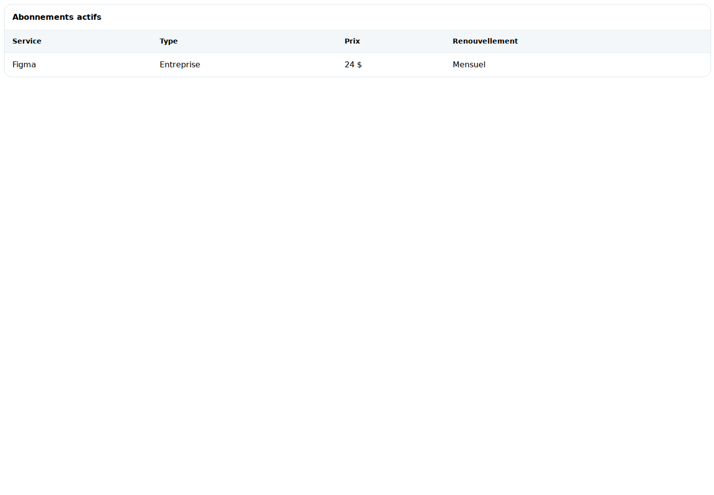

**Tablette**

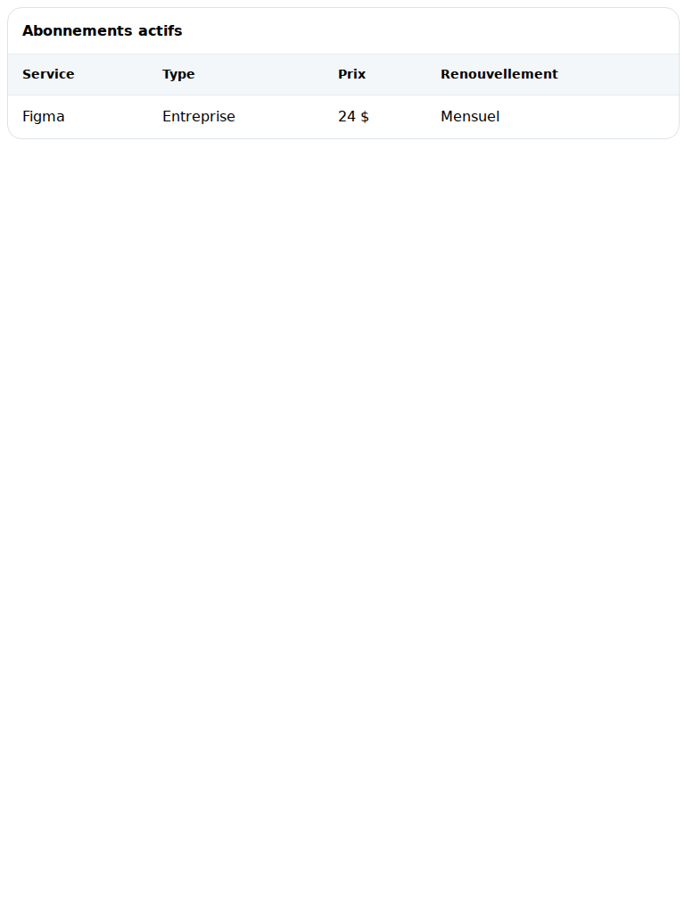

**Mobile**

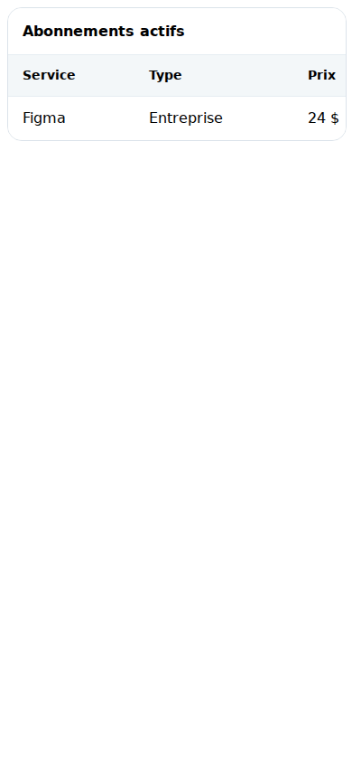

**Installer**

```bash
./pix-ssg templates installer table/data-table
```

**Intégrer**

- Fichier cible : `src/pages/<nom-de-page>.html`
- Emplacement : Dans <main>, à l’endroit où le composant doit apparaître : {{ component:data-table }}
- Données : `src/data/data_table.json`

```html
{{ component:data-table }}
<link rel="stylesheet" href="/assets/css/templates/data-table.css" />
```

**Désinstaller**

```bash
./pix-ssg templates desinstaller table/data-table
```

Documentation détaillée : [`table/data-table/README.md`](table/data-table/README.md)

---

### Tableau financier

`table/finance-table`

Version installable du template Tableau financier, configurable par données JSON.

**Desktop**

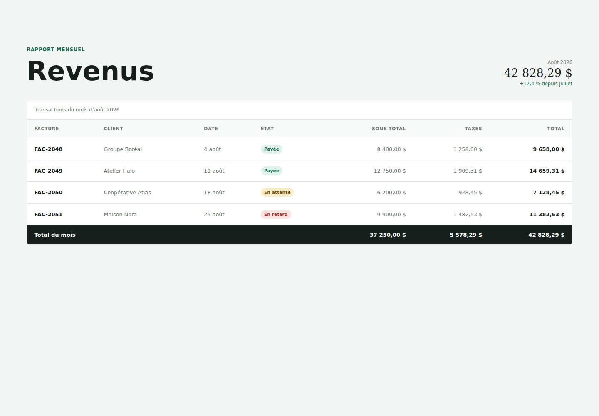

**Tablette**

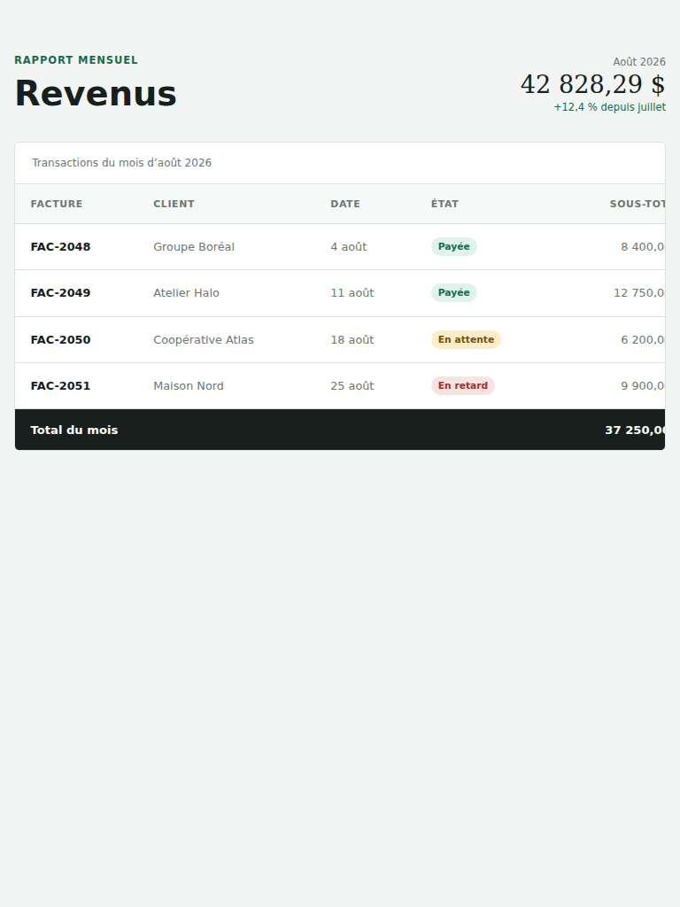

**Mobile**

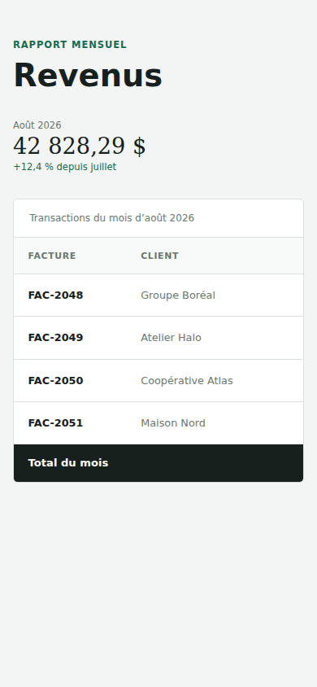

**Installer**

```bash
./pix-ssg templates installer table/finance-table
```

**Intégrer**

- Fichier cible : `src/pages/<nom-de-page>.html`
- Emplacement : Dans <main>, à l’endroit où le composant doit apparaître : {{ component:finance-table }}
- Données : `src/data/finance_table.json`

```html
{{ component:finance-table }}
<link rel="stylesheet" href="/assets/css/templates/finance-table.css" />
```

**Désinstaller**

```bash
./pix-ssg templates desinstaller table/finance-table
```

Documentation détaillée : [`table/finance-table/README.md`](table/finance-table/README.md)

---

### Tableau responsive

`table/responsive-table`

Version installable du template Tableau responsive, configurable par données JSON.

**Desktop**

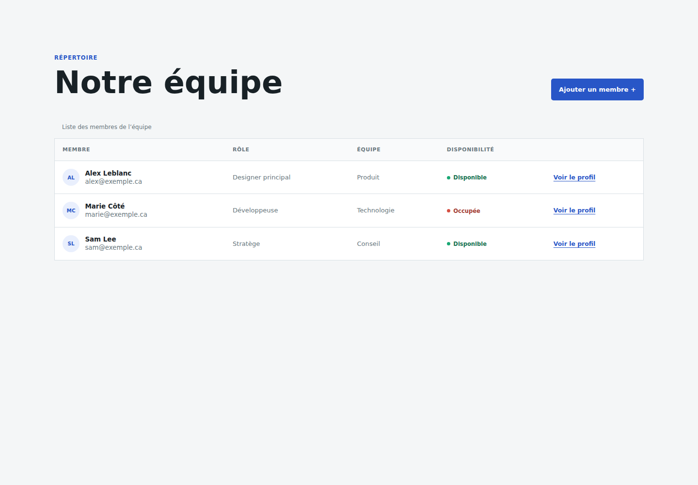

**Tablette**

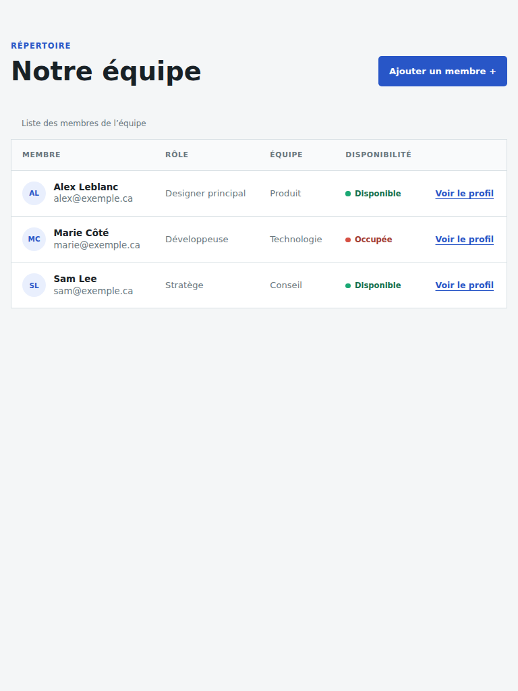

**Mobile**

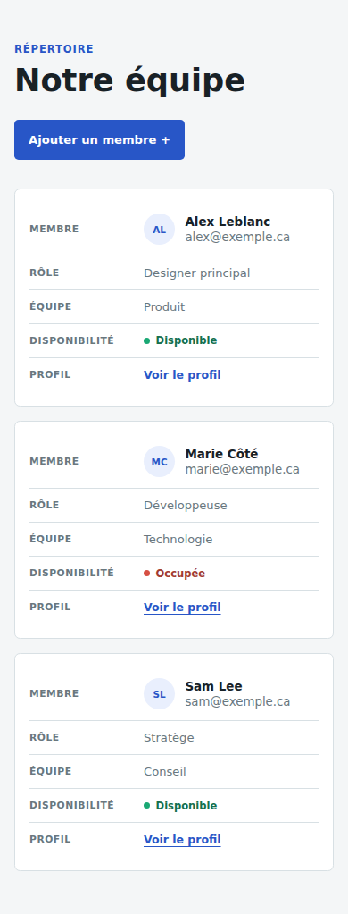

**Installer**

```bash
./pix-ssg templates installer table/responsive-table
```

**Intégrer**

- Fichier cible : `src/pages/<nom-de-page>.html`
- Emplacement : Dans <main>, à l’endroit où le composant doit apparaître : {{ component:responsive-table }}
- Données : `src/data/responsive_table.json`

```html
{{ component:responsive-table }}
<link rel="stylesheet" href="/assets/css/templates/responsive-table.css" />
```

**Désinstaller**

```bash
./pix-ssg templates desinstaller table/responsive-table
```

Documentation détaillée : [`table/responsive-table/README.md`](table/responsive-table/README.md)

---
